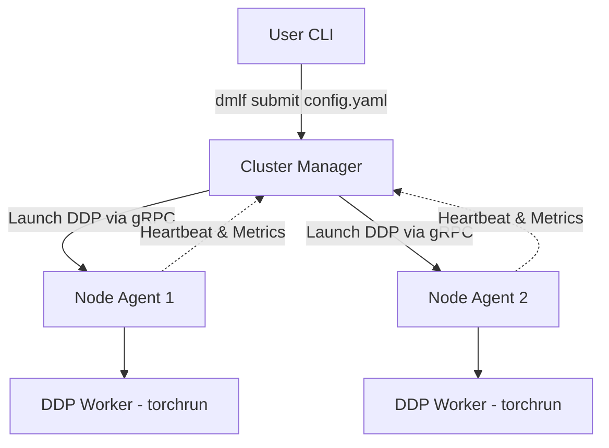

# Distributed Machine Learning Framework (DMLF)

DMLF is a lightweight, fault-tolerant orchestration layer and distributed training framework built on top of PyTorch Distributed Data Parallel (DDP). 

It bridges the gap between running ML experiments on a single machine and scaling them seamlessly across a heterogeneous cluster of local machines (like laptops on a LAN) without the massive overhead of Kubernetes or Slurm.

---

## 🚀 Features

- **PyTorch DDP Core**: Leverages PyTorch's native `torch.distributed` and `torchrun` for efficient multi-process gradient synchronization (using Gloo or NCCL).
- **Cluster Management Layer (CML)**: A custom gRPC-based orchestrator that tracks node health, availability, and hardware metrics via SQLite.
- **Automated Node Discovery**: Worker nodes run a lightweight background agent that automatically registers with the central Master node.
- **Heartbeat & Telemetry**: Agents stream CPU, RAM, and GPU utilization metrics to the master every 5 seconds.
- **YAML Job Submission**: No more manually configuring complex `torchrun` commands across multiple machines. Submit a single YAML file, and the Master node automatically provisions the cluster and dispatches the execution payloads.

---

## 🏗️ Architecture

### 1. The Master Node (`Cluster Manager`)
The central brain of the framework. It maintains the cluster state (idle, training, offline) in a local SQLite database and hosts a gRPC server to receive heartbeats and job submissions.

### 2. The Worker Nodes (`Node Agent`)
A lightweight daemon running on all compute nodes. It profiles the local hardware on startup, registers with the Master, and maintains an open gRPC stream waiting for `LAUNCH_JOB` commands. 

### 3. The CLI
A user-friendly command-line interface to submit jobs to the Cluster Manager.



---

## 🛠️ Installation

1. **Clone the repository**
2. **Create a virtual environment (Python 3.10+ recommended)**
   ```bash
   python -m venv venv
   source venv/bin/activate
   ```
3. **Install Dependencies**
   ```bash
   pip install -r requirements.txt
   ```
4. **Compile gRPC Protobufs** (If modifying the networking layer)
   ```bash
   python -m grpc_tools.protoc -I. --python_out=. --grpc_python_out=. dmlf/communication/cml.proto
   ```

---

## 🏃‍♂️ Quick Start (Local Cluster Simulation)

You can simulate a distributed cluster on a single machine by running the Master and Agents in separate terminals.

### 1. Start the Cluster Manager (Terminal 1)
```bash
source venv/bin/activate
python -m dmlf.manager.cluster_manager
```
*Expected Output: `Cluster Manager started on port 50051`*

### 2. Start the Node Agents (Terminals 2 & 3)
Open two new terminals to act as Worker 1 and Worker 2.
```bash
source venv/bin/activate
python -m dmlf.agent.agent
```
*Expected Output: `Registration successful! Node ID: node-xxxx`*

### 3. Submit a Training Job (Terminal 4)
Using the provided `resnet.yaml` configuration file, submit the job to the cluster.
```bash
source venv/bin/activate
python -m dmlf.cli submit dmlf/configs/resnet.yaml
```

The Cluster Manager will select two idle nodes and automatically spin up the distributed `torchrun` training loops!

### Persistent Windows LAN setup

For a two-device Windows cluster, run this once on **each** device from the DMLF project root. Choose the physical Wi-Fi/Ethernet IPv4 address and adapter name, not a VPN, WSL, or virtual adapter.

```powershell
.\setup-dmlf-node.ps1
```

The saved `dmlf-node.json` is local-only and is ignored by Git. Afterwards, use these commands:

```powershell
# Manager machine: use separate terminals
.\start-dmlf-manager.ps1
.\start-dmlf-bridge.ps1
.\start-dmlf-node.ps1

# Every additional worker machine
.\start-dmlf-node.ps1
```

The worker script automatically exports `DMLF_ADVERTISE_IP` and `DMLF_GLOO_INTERFACE` before registering with the manager, preventing incorrect VPN/WSL adapter selection.

---

## ⚙️ Configuration (YAML)

Jobs are submitted using standard YAML files to completely decouple configuration from code.

**`dmlf/configs/resnet.yaml`**
```yaml
cluster:
  nodes: 2
  backend: gloo

training:
  script_path: "train.py"
  nproc_per_node: 1
  args: ""
```

---

## 📊 Roadmap

- **Phase 1**: PyTorch DDP Core (MVP) ✅
- **Phase 2**: Cluster Orchestration Layer (gRPC/SQLite) ✅
- **Phase 3**: Custom Distributed Socket Layer (Replacing DDP constraints) 🚧
- **Phase 4**: Heterogeneous Hardware Scheduling 🚧
