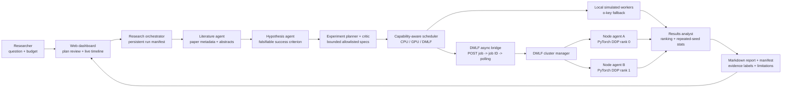

# Distributed AI Research Scientist

An autonomous, auditable research loop for machine-learning experiments. It turns a question into a literature brief, a testable hypothesis, an experiment plan, parallel jobs on heterogeneous workers, a result analysis, and a Markdown report.

This repository is deliberately scoped for a hackathon demo. It uses deterministic local agents by default, so the complete flow is runnable with no model credentials. Set `OPENAI_API_KEY` to switch the literature, hypothesis, and report agents to the OpenAI Responses API.

> **Pitch:** An auditable, human-approved AI research loop that plans ML experiments, runs them on distributed compute, and turns results into reproducible reports.

## Architecture



The LLM-facing agents never receive shell access or credentials. They produce validated research-plan data; the scheduler and DMLF bridge execute only bounded experiment specifications.

## Demo in 60 seconds

```powershell
npm test
npm start
```

In another terminal:

```powershell
Invoke-RestMethod -Method Post http://localhost:3000/runs -ContentType 'application/json' -Body '{"question":"Does augmentation improve a small image classifier?","budget":{"maxExperiments":3,"maxEpochs":8}}'
```

Use `GET /runs/:id` to inspect the research timeline and `GET /runs/:id/report` to retrieve the Markdown report.

No API key, package install, or internet connection is required for this default path. It is an offline, deterministic orchestration demo, so its metrics are visibly marked **simulated**.

## One-command Docker demo

To start the dashboard, DMLF manager, asynchronous bridge, and two CPU worker agents together:

```powershell
docker compose up --build
```

Then open `http://localhost:3000/`. The Compose stack is preconfigured for the two-node synthetic DDP smoke test. See [docker-compose.md](docs/docker-compose.md) for the exact flow, reset command, and multi-machine boundary.

For a real two-physical-machine DDP recording, use the [two-machine DMLF runbook](docs/two-machine-demo.md). It starts one manager/bridge/dashboard on Machine A and one native DMLF agent on each machine.

## Real two-machine DDP demo

Use this path when you want to show two physical computers participating in one DDP job. Keep both devices on the same LAN and use their physical Wi-Fi or Ethernet adapter (not VPN/WSL/virtual adapters).

### 1. Prepare both machines

Clone the repository on both machines, then create the DMLF environment from the nested project directory:

```powershell
cd .\AI-Research-Scientist\Distributed-ML-Training-main\Distributed-ML-Training-main
py -m venv .venv
.\.venv\Scripts\python.exe -m pip install -r requirements.txt
```

Find each machine's LAN IPv4 address with `ipconfig`, and find its active adapter name with:

```powershell
Get-NetAdapter | Where-Object Status -eq Up | Select-Object Name, InterfaceDescription
```

On both machines, allow inbound DDP rendezvous traffic. On Machine A, also allow the DMLF manager port. Run PowerShell as Administrator:

```powershell
New-NetFirewallRule -DisplayName 'DMLF DDP Rendezvous' -Direction Inbound -Protocol TCP -LocalPort 20000-39999 -Action Allow
New-NetFirewallRule -DisplayName 'DMLF Manager gRPC' -Direction Inbound -Protocol TCP -LocalPort 50051 -Action Allow
```

### 2. Start Machine A (manager machine)

Replace the address and adapter name with Machine A's actual LAN values, then save the configuration:

```powershell
.\setup-dmlf-node.ps1 -ManagerAddress '<MANAGER-LAN-IP>:50051' -AdvertiseIp '<MACHINE-A-LAN-IP>' -GlooInterface 'Wi-Fi'
```

Open four terminals:

```powershell
# DMLF directory: terminal 1, 2, and 3
.\start-dmlf-manager.ps1
.\start-dmlf-bridge.ps1
.\start-dmlf-node.ps1

# Repository root: terminal 4
npm.cmd start
```

### 3. Start Machine B (worker machine)

Check that it can reach Machine A's manager, then configure and start its agent. Replace the example IPs and adapter name:

```powershell
.\.venv\Scripts\python.exe -m dmlf.preflight --manager <MANAGER-LAN-IP>:50051
.\setup-dmlf-node.ps1 -ManagerAddress '<MANAGER-LAN-IP>:50051' -AdvertiseIp '<MACHINE-B-LAN-IP>' -GlooInterface 'Wi-Fi'
.\start-dmlf-node.ps1
```

The preflight result must show `"reachable": true` before continuing.

### 4. Run the video demo

On Machine A, open `http://localhost:3000/dmlf`, wait for two `IDLE` nodes, then enable DMLF with bridge endpoint `http://127.0.0.1:8002` and `2` required nodes.

On the research dashboard, select **DMLF synthetic - execution smoke test** and use:

> Does an offline DMLF synthetic classifier execute correctly across two distributed workers?

Set one experiment, one epoch, and one seed repetition. Preview the plan, run it, and show the job assignment, live progress, real `validation_accuracy`, report, and manifest. The metric validates real distributed execution on synthetic data; it is not benchmark evidence.

To review the proposed literature brief, hypothesis, and experiment configuration before scheduling workers, submit the same request to `POST /runs/preview`. Preview records are deliberately not persisted or executed.

## OpenAI configuration

```powershell
$env:OPENAI_API_KEY = '...'
$env:OPENAI_MODEL = 'gpt-5.6' # preserve this hackathon target, or set an available model in your account
npm start
```

No SDK is required: the OpenAI adapter calls the Responses API directly. The app safely falls back to deterministic local agents if the key is absent. Do not expose `OPENAI_API_KEY` to browsers or commit it.

Copy `.env.example` to `.env` and populate only the settings you need. This MVP reads environment variables from the shell, so load `.env` through your preferred local environment tool or set them directly in PowerShell.

## How we used Codex and GPT-5.6

**Codex** was used as the development collaborator for this project: it helped design the multi-agent architecture, scaffold the Node.js dashboard and API, implement the asynchronous DMLF bridge contract, add the DMLF configuration UI, write the Docker and two-machine setup, and build regression tests and submission documentation.

**GPT-5.6** is the optional reasoning layer behind the research agents. When `OPENAI_API_KEY` is configured, the app uses the Responses API with `OPENAI_MODEL=gpt-5.6` for bounded literature synthesis, falsifiable hypothesis generation, and final report drafting. The generated output is converted into inspectable research artifacts; it never receives shell access, credentials, or direct worker-control authority.

The default public demo intentionally runs with no API key. In that mode, deterministic local agents preserve the identical plan-review, scheduler, reporting, and manifest contracts so the full project remains runnable offline. The run manifest records the active provider, model setting, and prompt versions so a judge can distinguish model-backed and offline-fallback runs.

Optional paper retrieval uses the [Semantic Scholar Academic Graph API](https://api.semanticscholar.org/api-docs/graph). Set `PAPER_SEARCH_ENABLED=true` to retrieve up to five paper metadata records before synthesis; an API key can be supplied through `SEMANTIC_SCHOLAR_API_KEY` if available. Retrieval failure falls back safely to offline-demo mode.

Semantic Scholar may return HTTP 429 when rate-limiting requests. Successful searches are cached locally for five minutes; avoid repeated searches for the same question, wait for the retry interval if supplied, or configure `SEMANTIC_SCHOLAR_API_KEY`. When Semantic Scholar has no usable response, the app automatically tries the [OpenAlex Works API](https://developers.openalex.org/api-reference/works/list-works); set `OPENALEX_SEARCH_ENABLED=false` to disable that fallback.

When retrieval is enabled, use **Find papers for this question** in the dashboard and explicitly check only the metadata records you approve. The selected records, benchmark definition, prompt versions, active model setting, and paper-review decision are saved in the run manifest.

## What is real now

- Research run API and persistent JSON run records
- Agent contracts and sequential research orchestration
- Capability-aware scheduler for CPU/GPU-like workers
- Parallel, simulated training jobs with reproducible metrics
- Analysis, recommendation, timeline, and Markdown report generation
- Deterministic test coverage for a complete run
- A completed two-node PyTorch DDP execution path through DMLF, including real structured metrics, async progress polling, cancellation, and durable job history
- Benchmark presets for real MNIST DDP runs and explicitly-labelled synthetic DDP smoke tests
- Repeated-seed planning with mean and standard-deviation analysis (up to five repetitions)

## Submission-ready demo paths

| Path | What it proves | Requirements | Evidence label |
| --- | --- | --- | --- |
| Offline dashboard | Research planning, review gates, scheduling, auditability, reports | `npm.cmd start` | Simulated |
| DMLF synthetic two-node | Real asynchronous DDP coordination across two machines | Two running DMLF nodes | Real execution; not benchmark evidence |
| DMLF MNIST | Real DDP training on a public dataset | Two running nodes plus MNIST download on each node | Real benchmark run |

For a reliable short recording, use the **DMLF synthetic two-node** path: it proves distributed execution without depending on dataset download. Select **DMLF synthetic - execution smoke test**, set one experiment, one epoch, and one seed repetition. The report will correctly preserve the synthetic-data limitation.

See the concise [demo script](docs/demo-script.md) and [submission checklist](docs/submission-checklist.md) before recording or submitting.

## What to show judges

1. **Human approval before compute:** preview the literature brief, hypothesis, critic verdict, and bounded experiment plan.
2. **Distributed execution you can inspect:** show two registered DMLF nodes, a submitted job ID, asynchronous progress updates, and the completed structured metric.
3. **Evidence, not hype:** open the final report and manifest. Synthetic runs state that they validate execution rather than benchmark performance; repeated-seed runs expose mean and variance.

Use [screenshot-capture.md](docs/screenshot-capture.md) to collect the three recommended submission images in under five minutes.

## Next build steps

See [architecture.md](docs/architecture.md) and [implementation-plan.md](docs/implementation-plan.md). The first production substitution is `SimulatedWorker.execute()` in `src/workers.js`: replace it with an authenticated remote worker that runs a containerized training command and uploads metrics.

An HTTP `RemoteWorker` adapter and its minimal safe contract are now included in [worker-protocol.md](docs/worker-protocol.md). Keep worker endpoints and tokens in trusted server configuration, not browser code.

## Real DMLF distributed execution

The included `Distributed-ML-Training-main` project is integrated as an optional `dmlf` worker. It preserves the existing DMLF Cluster Manager, node allocation, gRPC node agents, `torchrun`, and PyTorch DDP; the added bridge only adapts DMLF's durable job state to this dashboard's asynchronous worker protocol. Follow [dmlf-integration.md](docs/dmlf-integration.md) to run the CPU-safe MNIST proof locally or connect multiple DMLF nodes.

Open [the DMLF configuration dashboard](http://localhost:3000/dmlf) after starting the app to enable or disable DMLF execution, set the bridge and manager addresses, choose the requested node count, and plan CPU/GPU nodes. The live registry is read from the DMLF bridge and remains authoritative: planned nodes do not replace node-agent hardware discovery.

To replace the default simulators, configure trusted server-side worker definitions before starting the app. For example:

```powershell
$env:WORKER_CONFIG_JSON = '[{"type":"remote","id":"gpu-lab-02","endpoint":"https://worker.example/execute","capabilities":["cpu","gpu"],"slots":1,"token":"server-side-token"}]'
npm.cmd start
```

Do not put this value, remote tokens, or worker endpoints in browser code. See [worker-protocol.md](docs/worker-protocol.md) for the executor contract.

For a recording-ready walkthrough, use [demo-script.md](docs/demo-script.md).
For benchmark definitions and data-status boundaries, use [benchmarks.md](docs/benchmarks.md).
