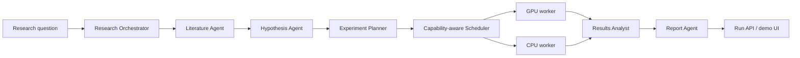

# Architecture

## Product boundary

The MVP is a research-orchestration product, not a claim of autonomous scientific discovery. A user supplies a focused ML question and compute budget. The system produces a transparent proposed experiment set, executes bounded jobs, and makes the evidence and limitations visible in the report.

## Agent contracts

Each agent consumes and returns JSON rather than free-form hidden state. This keeps the demo inspectable and enables a human approval gate before expensive work.

| Agent | Input | Output |
| --- | --- | --- |
| Literature | question | cited-looking research themes and caveats |
| Hypothesis | question + literature brief | falsifiable hypothesis and success metric |
| Planner | hypothesis + budget | independent, bounded experiment specifications |
| Analyst | completed metrics | ranking, evidence and recommended next experiment |
| Reporter | complete run | Markdown report with limitations |

The `AgentGateway` has two implementations: deterministic local behavior for demos/tests, and a narrow OpenAI Responses API adapter. The model is used for bounded synthesis, never granted shell, filesystem, credential, or worker-control access.

## Distributed execution boundary

The scheduler selects a compatible, least-loaded worker from a capability registry. Workers expose only `execute(experiment) -> metrics`; scheduling decisions and job history are persisted by the orchestrator. The MVP has simulated workers, which prove the orchestration and execution contracts. Replace a worker with an HTTPS/gRPC runner later without modifying agents or reports.

Worker registration in a production version should include signed identity, allowed container images, resource limits, datasets, GPU memory, and a heartbeat. Jobs should be idempotent and carry a run/experiment ID for deduplication.

## Safety and research integrity

- Budget limits cap runs and epochs before scheduling.
- Generated plans are data, validated by the planner, not arbitrary commands.
- Reports label simulated evidence and never claim publication-quality validation.
- API keys stay server-side; external model calls have timeouts and an offline fallback.
- A future real-run path should require human approval, isolated containers, dataset licenses, and immutable experiment artifacts.

